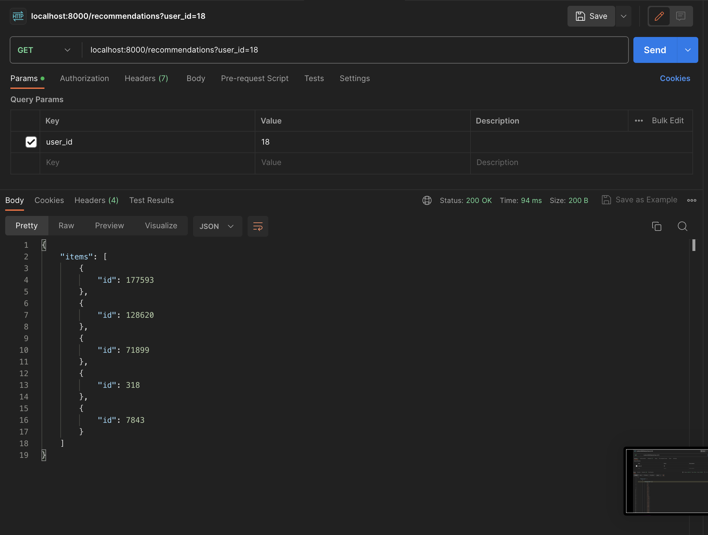
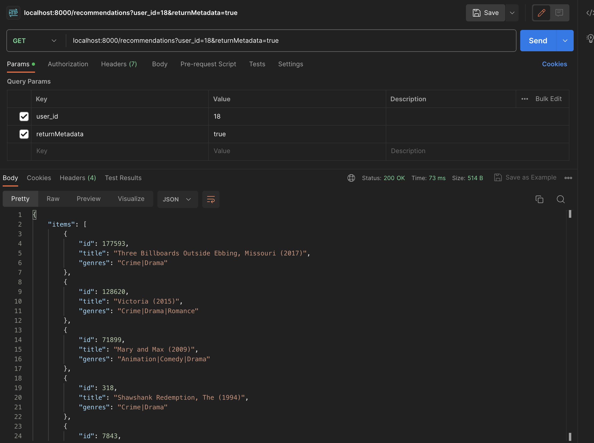
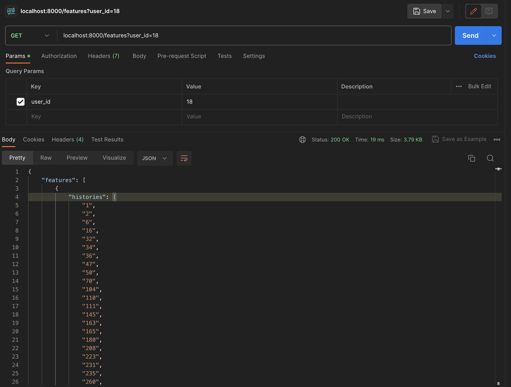

# How to use this repo
Firstly, install package by using Poetry tool
```
$ cd recommendation_system/
$ poetry install
```

After that, you have to download dataset from https://github.com/lukkiddd-tdg/movielens-small/tree/main and it's will show movielens-small folder.

Next, exporting recommendation model by running "traning_model.ipynb" notebook which the model will be saved at './app/weight' folder named "recommend_algor"

Then you can run api server by
```
$ uvicorn app.main:app [--log-level debug] [--port 10001]
```

----

# How to send the request by using CURL
1. return only content id
2. return the content metadata
3. return the model features
```
$ curl --location 'localhost:8000/recommendations?user_id=18'
$ curl --location 'localhost:8000/recommendations?user_id=18&returnMetadata=true'
$ curl --location 'localhost:8000/features?user_id=18'
```

----

Here is the result
=======
* GET /recommendations


<br>

* GET /recommendations (with metadata)


<br>

* GET /features 


How to improve in the future
========================

Improving Recommendation Model
-----------------------

1. ทดลองหลายๆ Model เพื่อหาผล Accuracy ที่มากที่สุด
2. เลือกใช้ฟีเจอร์ที่เหมาะสมเพื่อช่วยในการสร้างระบบ Recommendation ที่แม่นยำขึ้น
3. การเลือกใช้ดาต้าในการใช้แนะนำ content จะมีปัญหา seasonality ที่พฤติกรรม User เปลี่ยนแปลงได้จึงต้องมีการ retrain model อย่างสม่ำเสมอ


Using A/B testing for chosing model
--------

การใช้ A/B Testing model ในกรณีที่มีหลายโมเดลให้ผลแม่นยำและตัดสินใจไม่ได้ว่าจะเลือกใช้ตัวไหน วิธีนี้ก็จะช่วยให้สามารถเลือกใช้ algorithm ได้เหมาะสมมากยิ่งขึ้น

Speed perfomance for customer facing
---------

ความเร็วของระบบ Recommendation เป็นสิ่งสำคัญเพราะจะต้องทำงานกับข้อมูลจำนวนมากที่เกิดขึ้นในอดีต และอาจจะทำให้มีผลต่อความคาดหวังในเชิง Business ได้ หากไม่สามารถส่งผลออกมาให้ในระยะเวลาที่เหมาะสม ดังนั้นจึงต้องมีการออกแบบ infrastructure ที่เหมาะสมสำหรับ production และเลือกใช้เทคนิค Algorithm ทีให้ผลลัพธ์ที่ไวและมีประสิทธิภาพก็จำเป็นอย่างยิ่ง
